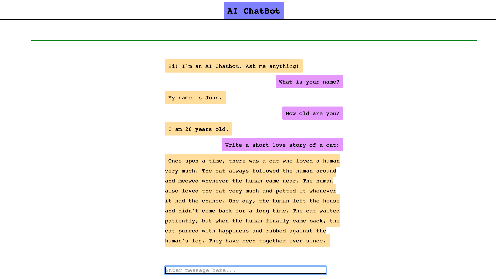

# AI Chat Bot using GPT-3
This repository contains an AI chat bot that utilizes the autoregressive transformer language model GPT-3 for interactive conversations. The chat bot's interactions are saved in the gpt3_logs directory.

## Getting Started
To get started with the chat bot, follow these steps:

1. Obtain OpenAI API Key: Visit the OpenAI website to obtain your API key.
2. Clone the Repository: Use the following command to clone the repository to your local machine :
    `git clone https://github.com/fahmiaziz98/bot_openai.git`

3. Create API Key File: Create a file named openaiapikey.txt in the root directory of the project and save your OpenAI API key in this file.
4. Install Dependencies: Install the necessary dependencies by running the following command: 
    `pip install -r requirements.txt`

Run the Application: Start the chat bot by running the flask_app.py script.
5. Deploy on AWS: If you want to deploy the chat bot on AWS, you can refer to the guide on deploying a GPT-3 flask application using AWS CodePipeline and Elastic Beanstalk [here](https://medium.com/@contact.blessin/deploying-a-gpt-3-flask-application-on-aws-codepipeline-and-elastic-beanstalk-681cd2ece897).

## Contributing
Contributions to the development and improvement of the AI chat bot are welcome. If you have any ideas, suggestions, or bug reports, please open an issue or submit a pull request.

## License
This project is licensed under the MIT License. Feel free to customize the README file according to your specific project requirements.